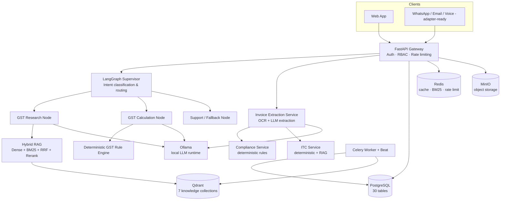
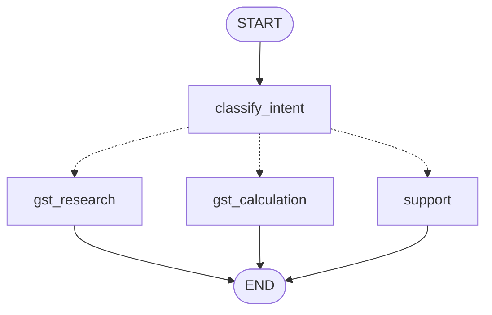

# GST AI Copilot

Intelligent GST, invoice, compliance and tax assistant for Indian SMEs, accountants, CA firms and finance teams — built on **agentic AI + RAG + deterministic GST rules**, running entirely on **open-source, self-hostable infrastructure**.

> **Not a filing system.** This product assists with GST research, invoice processing and compliance workflows. It does not perform official GST return filing and its outputs are not legal or tax advice — every high-impact or uncertain result is routed to human review.

---

## Table of contents

- [Product overview](#product-overview)
- [Architecture](#architecture)
- [Technology stack](#technology-stack)
- [Repository structure](#repository-structure)
- [Prerequisites](#prerequisites)
- [Quick start (Docker)](#quick-start-docker)
- [Local development (without Docker)](#local-development-without-docker)
- [Environment configuration](#environment-configuration)
- [Database migrations](#database-migrations)
- [Ollama model setup](#ollama-model-setup)
- [Ingesting GST knowledge documents](#ingesting-gst-knowledge-documents)
- [Sample / synthetic data](#sample--synthetic-data)
- [API documentation](#api-documentation)
- [Testing](#testing)
- [Evaluation](#evaluation)
- [Security](#security)
- [Observability](#observability)
- [Deployment](#deployment)
- [Known limitations](#known-limitations)
- [Future enhancements](#future-enhancements)

---

## Product overview

GST AI Copilot combines:

- **GST AI Chat** — grounded question answering over Indian GST law, with citations and confidence scoring.
- **Invoice AI** — OCR + LLM structured extraction of invoices (PDF/scanned/image), with per-field confidence.
- **GST Rule Engine** — a fully deterministic, LLM-free CGST/SGST/IGST/CESS calculator. The LLM never performs tax arithmetic.
- **Compliance Agent** — deterministic invoice validation rules (GSTIN format, duplicate detection, arithmetic consistency, mandatory fields) with an optional AI-generated plain-language explanation layered on top.
- **ITC Assistant** — invoice-level ITC pre-checks; never asserts unconditional eligibility (real eligibility depends on facts no single invoice can establish), always surfaces open questions for human review.
- **GSTR-2A/2B Reconciliation** — upload a GSTR-2A/2B CSV export from the GST portal and deterministically match it against the period's purchase invoices (`app/rules/gstr_reconciliation.py`, LLM-free): matched, mismatched (with the excess ITC at risk), missing from the supplier's filing, or missing from your books — reviewable in the UI, exportable as CSV. Not a live GSTN integration.
- **Double-entry accounting (Tally-style)** — chart of accounts, vouchers, and the financial statements: invoices post automatically to Sales/Purchase vouchers, and a fully deterministic engine (`app/rules/accounting.py`, LLM-free) produces the Trial Balance, Profit & Loss, Balance Sheet, Day Book, ledger statements and outstanding receivables/payables — with CSV export.
- **Return preparation** — deterministic GSTR-1 / GSTR-3B draft aggregation from a period's invoices, human-approved via the review queue, exportable as CSV. Not a filing integration.
- **Document Knowledge base** — versioned ingestion pipeline (OCR → chunk → embed → hybrid-index) for GST Acts, Rules, Notifications, Circulars, FAQs, and tenant-private documents.
- **Multi-tenant SaaS core** — organizations, RBAC, audit logging, human review queue, and DB-verified tenant isolation on every request.

### Architectural principle

```
                     AI Layer
                        │
        ┌───────────────┼────────────────┐
        ▼               ▼                ▼
       RAG          Agent Reasoning     Explanation
        │               │                │
        └───────────────┼────────────────┘
                        │
                        ▼
               Deterministic Core
                        │
             ┌──────────┼───────────┐
             ▼          ▼           ▼
           GST        Invoice     Compliance
          Rules       Rules        Rules
```

The deterministic core (`backend/app/rules/`) has **zero dependency on the LLM** and is independently unit-tested. GST knowledge/interpretation goes through grounded RAG with mandatory citations. High-impact or uncertain outputs are flagged `requires_human_review`.

---

## Architecture



### LangGraph supervisor graph



---

## Technology stack

| Layer | Choice | Notes |
|---|---|---|
| Frontend | Next.js 14, React 18, TypeScript, Tailwind CSS | App Router, TanStack Query, Zustand |
| Backend | Python 3.12, FastAPI, Pydantic v2, SQLAlchemy 2 (async), Alembic | Modular monolith |
| Agentic AI | LangGraph, LangChain | Supervisor + specialist node graph |
| LLM runtime | **Ollama** (local/self-hosted) | Swappable via `LLM_PROVIDER`; OpenAI-compatible adapter included |
| Embeddings | `fastembed` (BAAI/bge-small-en-v1.5, local ONNX) | Swappable via `EMBEDDING_PROVIDER` |
| Reranker | `fastembed` cross-encoder (BAAI/bge-reranker-base) | Optional, `RERANKER_ENABLED` |
| Vector DB | Qdrant | 7 collections, tenant-filtered |
| Relational DB | PostgreSQL 16 | 30 tables, UUID PKs, audit columns |
| Cache / queue | Redis | Cache, rate limiting, BM25 index, Celery broker |
| Object storage | MinIO (S3-compatible) | 6 buckets |
| Background jobs | Celery + Redis | Re-indexing, scheduled compliance scans |
| OCR | Tesseract (default) / PaddleOCR (optional extra) | Swappable via `OCR_PROVIDER` |
| Observability | OpenTelemetry, Prometheus, Grafana, Jaeger | |

No proprietary cloud service is required to run the full stack.

---

## Repository structure

```text
gst-ai-copilot/
├── backend/
│   ├── app/
│   │   ├── api/v1/          # FastAPI routers
│   │   ├── agents/          # LangGraph state, intents, graph, nodes
│   │   ├── rag/             # embeddings, BM25, hybrid retrieval, RAG pipeline
│   │   ├── rules/           # GST calculator, GSTIN validator, invoice rules (LLM-free)
│   │   ├── ingestion/       # OCR, document loaders, chunking
│   │   ├── llm/             # LLMProvider abstraction (Ollama/OpenAI)
│   │   ├── models/          # SQLAlchemy ORM models (30 tables)
│   │   ├── schemas/         # Pydantic request/response schemas
│   │   ├── services/        # business logic orchestration
│   │   ├── repositories/    # tenant-scoped data access base
│   │   ├── security/        # auth deps, JWT, password hashing, file validation
│   │   ├── storage/         # MinIO abstraction
│   │   ├── workers/         # Celery app + tasks
│   │   ├── core/            # config-independent infra (db, redis, logging, errors)
│   │   └── config/          # typed Settings
│   ├── evaluation/          # retrieval/generation metrics + runner
│   ├── alembic/             # migrations
│   ├── tests/unit/          # 111 passing, LLM/DB-free tests
│   └── pyproject.toml
├── frontend/
│   ├── app/                 # Next.js App Router pages
│   ├── components/          # UI primitives + app shell
│   └── lib/                 # api client, auth store, utils
├── data/
│   ├── sample_invoices/
│   ├── knowledge/
│   └── evaluation/          # queries/expected_answers/retrieval_cases/invoice_cases
├── docker/                  # prometheus config, etc.
├── docker-compose.yml
├── .env.example
├── Makefile
└── LICENSE
```

---

## Prerequisites

- **Docker Desktop** (or Docker Engine + Compose v2) — for the full stack
- **Python 3.12+** and **Node.js 20+** — for local (non-Docker) development
- ~8GB RAM free for Ollama to run a 7B-class model comfortably

---

## Quick start (Docker)

```bash
cp .env.example .env
# edit .env — at minimum change APP_SECRET_KEY, JWT_SECRET, POSTGRES_PASSWORD, OBJECT_STORAGE_SECRET_KEY

docker compose up -d --build

# Pull the default LLM (first run only; ~4-5GB download)
docker exec gst_ollama ollama pull qwen2.5:7b-instruct

# Run database migrations
docker exec gst_backend alembic upgrade head
```

Then open:

- Frontend: http://localhost:3000
- API docs: http://localhost:8000/docs
- MinIO console: http://localhost:9001
- Grafana: http://localhost:3001 (admin/admin)
- Jaeger UI: http://localhost:16686

Register your first account at `/register` — this creates both your user and your organization (you become `org_admin`).

---

## Local development (without Docker)

Windows PowerShell:

```powershell
# Backend
cd backend
python -m venv .venv
.venv\Scripts\pip install -e ".[dev]"
.venv\Scripts\python -m alembic upgrade head   # requires Postgres reachable per DATABASE_URL
.venv\Scripts\uvicorn app.main:app --reload

# Frontend (separate terminal)
cd frontend
npm install
npm run dev
```

macOS/Linux:

```bash
make setup        # creates backend venv + installs frontend deps
make dev-backend  # in one terminal
make dev-frontend # in another terminal
```

You still need Postgres, Redis, Qdrant, MinIO and Ollama reachable — either run them via `docker compose up -d postgres redis qdrant minio ollama` (backend/frontend excluded) or point `.env` at your own instances.

---

## Environment configuration

See [`.env.example`](.env.example) for the complete, documented list. Key groups:

- **App**: `APP_ENV`, `APP_SECRET_KEY`, `LOG_LEVEL`
- **Postgres**: `DATABASE_URL` (async, asyncpg) / `DATABASE_URL_SYNC`
- **Redis / Qdrant / MinIO**: connection URLs + bucket names
- **Ollama**: `OLLAMA_BASE_URL`, `OLLAMA_MODEL`, `OLLAMA_TEMPERATURE`
- **Embeddings**: `EMBEDDING_PROVIDER`, `EMBEDDING_MODEL`, `EMBEDDING_DIM`
- **JWT**: `JWT_SECRET`, token expiry
- **GST rules**: `GST_RULES_VERSION` — versions the deterministic engine's behavior

Never commit a real `.env`. `.gitignore` already excludes it.

---

## Database migrations

The first migration (`0001_initial_schema`) creates all 30 tables directly from the SQLAlchemy ORM metadata — every table, enum, index and FK is generated from `app/models/`, so it can never drift from the models on day one.

```bash
make migrate                    # apply migrations
make migrate-new name="thing"   # generate a new migration (needs a live Postgres to diff against)
```

All subsequent migrations should be generated normally via `alembic revision --autogenerate` against a running database.

---

## Ollama model setup

```bash
docker exec gst_ollama ollama pull qwen2.5:7b-instruct   # default
docker exec gst_ollama ollama pull llama3.1:8b           # alternative
docker exec gst_ollama ollama pull mistral:7b            # alternative
```

Set `OLLAMA_MODEL` in `.env` to whichever you pulled. The model is never hard-coded in application code — see `app/llm/factory.py`.

---

## Ingesting GST knowledge documents

Via the UI: **Documents** page → choose type (Act/Rule/Notification/Circular/FAQ/...) → upload → the pipeline runs OCR (if scanned), chunks, embeds, and indexes into the matching Qdrant collection automatically.

Via API:

```bash
curl -X POST http://localhost:8000/api/v1/documents/upload \
  -H "Authorization: Bearer $TOKEN" \
  -F "file=@cgst_act.pdf" \
  -F "document_type=act" \
  -F "title=CGST Act 2017"
```

---

## Sample / synthetic data

```bash
make seed
```

Creates one demo organization ("Synthetic Demo Traders Pvt Ltd"), an admin login, 10 customers, 10 vendors, and 120 invoices with **internally-consistent GST arithmetic** (computed via the real `GSTCalculator`, so demo data behaves exactly like production data). ~1/7 invoices are deliberately made non-compliant (missing GSTIN) to exercise the compliance features. The seed also runs a compliance check on every invoice, posts every invoice to the double-entry books (so the Trial Balance / P&L / Balance Sheet / Day Book are populated), generates GSTR-1 + GSTR-3B drafts for the two most recent periods, and opens a few review-queue tasks — so the Accounting, Returns, Review queue and Analytics pages all have data on a fresh seed. All data is clearly synthetic — no real GSTINs, businesses, or individuals.

Demo login printed at the end of the script: `demo.admin@gst-copilot.example` / `SyntheticDemo#2026`.

---

## API documentation

Interactive OpenAPI docs: `http://localhost:8000/docs` (disabled automatically when `APP_ENV=production`).

Representative endpoints:

```
POST /api/v1/auth/register              POST /api/v1/gst/calculate
POST /api/v1/auth/login                 POST /api/v1/gst/validate
POST /api/v1/auth/refresh               POST /api/v1/rag/search
GET  /api/v1/auth/me                    POST /api/v1/chat
PATCH /api/v1/auth/me                   POST /api/v1/chat/stream   (SSE token streaming)
                                         GET  /api/v1/chat/sessions
POST /api/v1/documents/upload           POST /api/v1/invoices/upload
GET  /api/v1/documents                  GET  /api/v1/invoices
POST /api/v1/documents/{id}/reindex     POST /api/v1/invoices/{id}/analyze
                                         POST /api/v1/compliance/check
                                         POST /api/v1/itc/analyze

# GSTR-2A/2B reconciliation (deterministic matching against purchase invoices)
POST /api/v1/reconciliation/upload      (CSV import for a period)
POST /api/v1/reconciliation/run         GET  /api/v1/reconciliation
GET  /api/v1/reconciliation/{id}        GET  /api/v1/reconciliation/{id}/matches
GET  /api/v1/reconciliation/{id}/export (CSV download)

# Return preparation (deterministic GSTR-1 / GSTR-3B drafts — not a filing integration)
GET  /api/v1/returns                    POST /api/v1/returns/generate
GET  /api/v1/returns/{id}               POST /api/v1/returns/{id}/submit
GET  /api/v1/returns/{id}/export        (CSV download)

# Human-in-the-loop review queue
GET  /api/v1/approvals                  GET  /api/v1/approvals/counts
POST /api/v1/approvals/{id}/decision    (approve | reject | modify)

# Organization settings + member administration (org-admin only for mutations)
GET/PATCH /api/v1/organizations/current
PUT  /api/v1/organizations/current/gst-profile
GET/POST  /api/v1/organizations/current/members
PATCH     /api/v1/organizations/current/members/{id}
GET/PUT   /api/v1/organizations/current/settings
GET       /api/v1/organizations/current/audit

# Analytics (read-only aggregations)
GET /api/v1/analytics/overview          GET /api/v1/analytics/gst-trend
GET /api/v1/analytics/compliance        GET /api/v1/analytics/agents
GET /api/v1/analytics/itc

# Double-entry accounting (Tally-style) — masters, vouchers, statements
GET/POST  /api/v1/accounting/ledgers          GET  /api/v1/accounting/groups
GET/POST  /api/v1/accounting/vouchers         GET  /api/v1/accounting/vouchers/{id}
POST      /api/v1/accounting/invoices/{id}/post          (invoice → Sales/Purchase voucher)
GET       /api/v1/accounting/ledgers/{id}/statement      (running balance)
GET       /api/v1/accounting/reports/trial-balance
GET       /api/v1/accounting/reports/profit-loss
GET       /api/v1/accounting/reports/balance-sheet
GET       /api/v1/accounting/reports/day-book
GET       /api/v1/accounting/reports/outstanding?kind=receivable|payable
GET       /api/v1/accounting/reports/{trial-balance|profit-loss|balance-sheet}/export   (CSV)
```

Every error response follows:

```json
{ "success": false, "error": { "code": "...", "message": "...", "request_id": "..." } }
```

---

## Testing

```bash
cd backend
pytest -v --cov=app --cov-report=term-missing   # 111 tests, all LLM/DB-free
ruff check app tests                              # lint
```

What's covered by fast, dependency-free unit tests: the GST calculator (14 tests, including a rounding-precision case), GSTIN checksum validation (against a real published GSTIN), invoice validation rules (14 tests), GSTR-2A/2B reconciliation matching (9 tests), chunking, file-upload validation, RAG pipeline's citation/confidence logic, and evaluation metrics (20 tests).

```bash
cd frontend
npx tsc --noEmit     # zero errors
npm run build        # verified: all routes build successfully
```

---

## Evaluation

```bash
make evaluate
```

Runs retrieval metrics (Recall@5, MRR, NDCG@5) and generation metrics (answer relevancy via required-phrase coverage, citation faithfulness) against `data/evaluation/*.jsonl`. **Requires the full stack running** (Ollama + Qdrant with documents ingested) — this is an integration-level evaluation, not a unit test. The seed datasets are illustrative; extend them once you've ingested your own GST knowledge base.

---

## Security

- JWT access/refresh tokens; **every request re-verifies org membership against the database** (not just the JWT payload), so a revoked membership or role change takes effect immediately and a forged `X-Organization-ID` header can never grant cross-tenant access.
- Bcrypt password hashing.
- Structural GSTIN validation (checksum algorithm) plus format checks.
- Upload validation: extension allowlist, size limit, and magic-byte content sniffing (not just trusting the client's declared MIME type).
- Rate limiting via `slowapi`.
- Structured logging with automatic secret/PII redaction (`app/core/logging.py`).
- Security headers (`X-Frame-Options`, `X-Content-Type-Options`, HSTS, etc.) on every response.
- Tenant isolation enforced structurally via `TenantScopedRepository` and DB-level `organization_id` filtering — see `app/repositories/base.py`.
- No secret is hard-coded anywhere; all configuration is environment-variable driven (`.env.example` documents every variable with a placeholder value).

---

## Observability

- **Structured JSON logs** with request/tenant/user correlation IDs (`structlog`).
- **OpenTelemetry** tracing exported to Jaeger (`OTEL_ENABLED=true`).
- **Prometheus** metrics at `/metrics`, scraped per `docker/prometheus/prometheus.yml`, visualized in Grafana.
- Every agent run is persisted (`agent_runs` / `agent_events` tables) with latency, intent, confidence, and human-review flags — independent of LangGraph's own checkpointing, which is optimized for resumability, not reporting.

---

## Deployment

**Local development**: `docker compose up -d --build` (this repo's compose file).

**Production**: containers are built the same way (`backend/Dockerfile`, `frontend/Dockerfile`) and are cloud-agnostic — deploy them to any container platform (Kubernetes, ECS, Cloud Run, etc.) behind your own ingress/ TLS termination, pointing at managed or self-hosted Postgres/Redis/Qdrant/MinIO/Ollama. Kubernetes manifests are not included in this build — see [Known limitations](#known-limitations).

---

## Known limitations

Built without Docker available in the development environment, so the following are implemented and code-reviewed but **not verified against a live stack**:

- End-to-end flow (register → upload → OCR → RAG → compliance → ITC) has not been run against real Postgres/Qdrant/MinIO/Ollama — only unit-level and import/boot-level verification was possible here.
- `make evaluate` requires an ingested knowledge base and a running Ollama; not executed in this build.
- The initial Alembic migration uses `Base.metadata.create_all()` rather than hand-authored `op.create_table()` calls — correct and standard for a from-scratch first migration, but not autogenerate-diffed against a live DB. `0002_gst_returns` follows the same convention for the one new table it adds.
- No Kubernetes manifests / Helm chart yet (Docker Compose only).
- WhatsApp/email/voice channel *adapters* are not implemented — the architecture is adapter-ready (`ConversationService` is channel-agnostic; `ChatSession.channel` already models it), but only the web channel is wired up.
- The analytics aggregation queries use a couple of Postgres-specific functions (`to_char`) — correct for the Postgres 16 target, but they are not exercised by the LLM/DB-free unit suite.
- PaddleOCR is wired as an optional extra (`pip install -e ".[ocr-paddle]"`) but not installed/tested by default; Tesseract is the tested default.

## Feature areas added most recently

- **Streaming chat** — `POST /api/v1/chat/stream` streams the answer token-by-token over SSE (`app/rag/pipeline.py::stream_gst_answer` + `ConversationService.stream_message`); the web chat renders deltas live and still persists the turn + `AgentRun` audit row exactly as the non-streaming path does.
- **Return preparation** — deterministic GSTR-1 / GSTR-3B draft aggregation from a period's invoices (`app/rules/return_aggregation.py`, LLM-free and unit-tested), reviewable in the UI, routed through the approval queue, exportable as CSV. Not a filing integration — nothing is transmitted to the GSTN.
- **Human review queue** — `review_tasks` (`Approval`) now has a full API + UI. Compliance exceptions, ITC assessments and return drafts open review tasks; an approver approves / rejects / modifies each with an audit-logged decision.
- **Settings + admin console** — organization + GST-profile editing, member administration (add / role / activate, with a "can't remove the last admin" guard in `app/rules/org_membership.py`), org-scoped key/value settings, and an audit-trail viewer.
- **Analytics dashboard** — read-only aggregation endpoints (`/api/v1/analytics/*`) for GST trend (output tax vs. ITC vs. net), compliance score/issue trends, agent-run intent/latency/escalation metrics and ITC status — rendered as a multi-chart dashboard.
- **Tally-style double-entry accounting** — `ledger_groups` / `ledgers` / `vouchers` / `voucher_entries` tables, a Tally-shaped default chart of accounts seeded per organization, automatic invoice → voucher posting (`Dr Debtor / Cr Sales + Cr Output GST`, and the mirror for purchases), manual journal/payment/receipt/contra vouchers with a balance guard, and the deterministic financial statements — Trial Balance, Profit & Loss, Balance Sheet, Day Book, per-ledger statement with running balance, and outstanding receivables/payables — all exportable as CSV. The statement math lives in `app/rules/accounting.py` (LLM-free, unit-tested: every voucher balances, the trial balance ties, Assets = Liabilities + Equity). The web app exposes a "Gateway of Accounts" with the ledgers, day book and the three statements. This is bookkeeping and reporting only — it does not file anything.

- **GSTR-2A/2B reconciliation** — `app/rules/gstr_reconciliation.py` (LLM-free, unit-tested) matches purchase invoices against an uploaded GSTR-2A/2B CSV export by (supplier GSTIN, normalized invoice number), classifying each into matched / mismatch / missing-in-return / missing-in-books, with the excess ITC at risk computed per row and summed per run. `ReconciliationService` handles CSV parsing (tolerant of a few common GSTN export header variants) and persistence; re-uploading a period or re-running replaces its prior data. The web app exposes upload, run, a filterable match table, and CSV export under **Reconciliation**. Not a live GSTN integration — the export is downloaded from the portal by hand.

## Future enhancements

- Postgres-backed LangGraph checkpointer for multi-process deployment (currently in-memory `MemorySaver`, documented as a swap point in `app/agents/graph.py`).
- WhatsApp/voice channel adapters over the existing `ConversationService`.
- Kubernetes manifests / Helm chart for production deployment.
- Move return generation and bulk compliance scans fully onto Celery for large tenants (currently inline / nightly beat).
